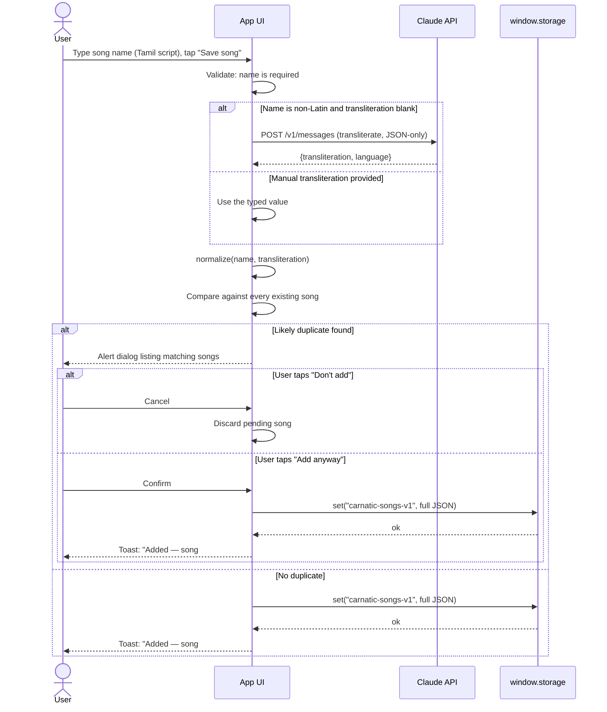
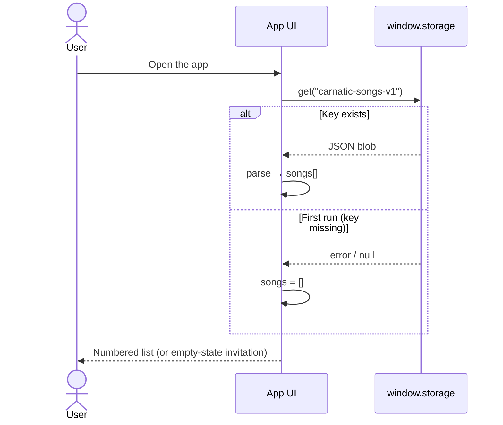
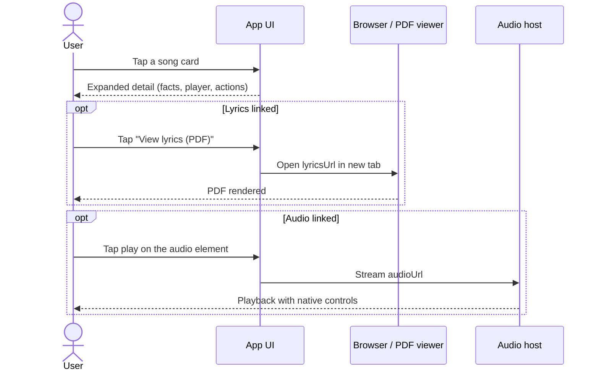
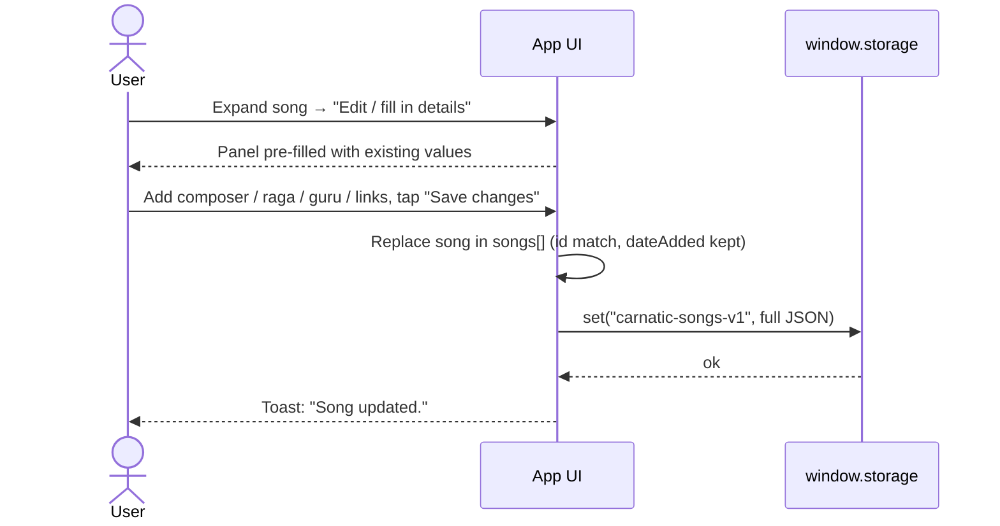

# Architecture — Paadal Pettagam

## Overview

A single-file React application. All state lives in one component tree, persistence is a single JSON blob in key-value storage, and the only external service is the Anthropic API, used for one job: transliterating original-script song names into Latin letters.

```
┌───────────────────────────────────────────────┐
│              CarnaticSongTracker              │
│  (single React component, default export)     │
│                                               │
│  Header · Stats · Controls (search / add)     │
│  Add-Edit Panel · Duplicate Dialog            │
│  Song List → Song Card → Expanded Detail      │
│  Toast · Footer                               │
└───────────┬──────────────────────┬────────────┘
            │                      │
   window.storage           Anthropic API
   (persistent KV,          (transliteration
    one JSON blob)           via Claude)
```

## State

| State | Purpose |
|---|---|
| `songs` | The full collection, source of truth, mirrored to storage on every mutation |
| `search` | Live filter text |
| `panel`, `form`, `editingId` | Add/edit panel mode and its field values |
| `expandedId` | Which song card is open |
| `dupMatches`, `pendingSong` | Duplicate-alert dialog: the matches found and the song waiting for a decision |
| `busy`, `toast`, `loading` | Async/UI feedback |

Derived values (`useMemo`): unique guru / composer / raga lists (feed the autocomplete datalists and stats), and the filtered song list.

## Storage layer

- One key: `carnatic-songs-v1` → `JSON.stringify(songs)`.
- A single blob keeps writes atomic and avoids sequential per-song calls.
- `loadSongs()` treats a missing key as an empty collection (first run).
- Every mutation goes through `commit(next)`: set state, then persist; a failed persist surfaces a toast but never loses in-memory state.

## Transliteration service

`aiTransliterate(text)` sends the original-script name to Claude with a strict instruction: transliterate the *sounds* into conventional Carnatic romanization, do **not** translate the meaning, return minified JSON only (`{transliteration, language}`). The response is fence-stripped and parsed. It is called only when the name contains non-Latin characters **and** the user left the transliteration field blank — a manually typed transliteration always wins. Failure is non-fatal: the song saves anyway and the field can be edited later.

## Duplicate detection

`normalize()` lowercases, strips diacritics (NFD decomposition), and removes punctuation/whitespace, keeping Latin alphanumerics and Indic script ranges. A candidate is a "hit" against an existing song when any normalized key (name or transliteration) exactly matches, or when one contains the other (both ≥ 6 chars, to avoid false positives on short names). Matches are shown in a blocking dialog; the user decides.

## Sequence diagrams

### Add a song (with transliteration and duplicate check)



### App start (load the notebook)



### Open lyrics and play audio



### Edit — filling in fields later



## Cross-platform strategy

One responsive web codebase rather than separate native builds. It runs in any modern browser on Android, iOS, and desktop; inside Claude it runs as an artifact with account-backed storage; hosted standalone it can be added to the home screen on both mobile platforms (see README). Layout breakpoints collapse the two-column form to one column under 540 px, cards wrap gracefully, and reduced-motion preferences are respected.

## Design system

| Token | Value | Role |
|---|---|---|
| Paper | `#F6EEDC` | Background — sandal manuscript |
| Ink | `#4A1416` | Text / primary — kanjivaram maroon |
| Peacock | `#16606B` | Secondary, labels, transliterations |
| Turmeric | `#C1922F` | Number medallions, accents |
| Kumkum | `#B3402A` | Counts, warnings |

Display type: Iowan Old Style / Palatino serif stack. Signature element: the four-string tambura divider under the title and the gold song-number medallions. Original script is always the largest text on each card, with the transliteration set beneath it in peacock.
